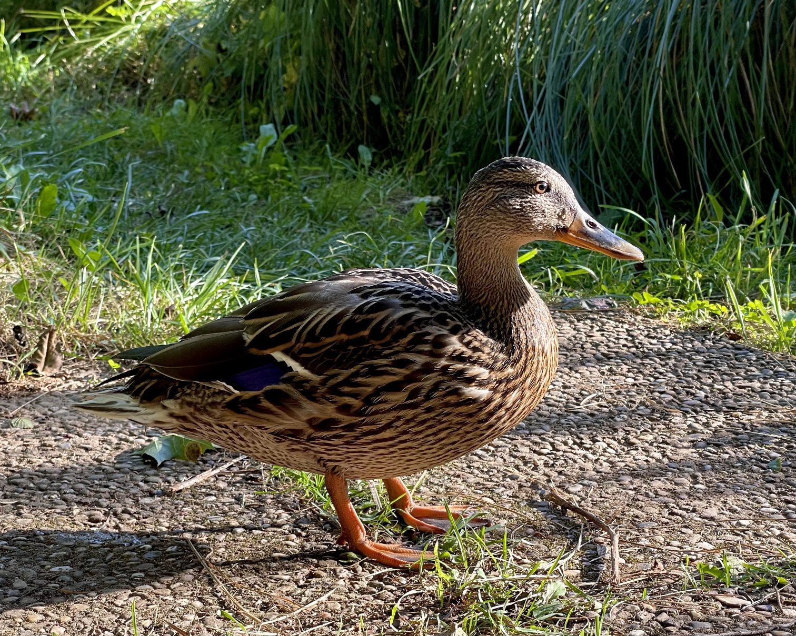
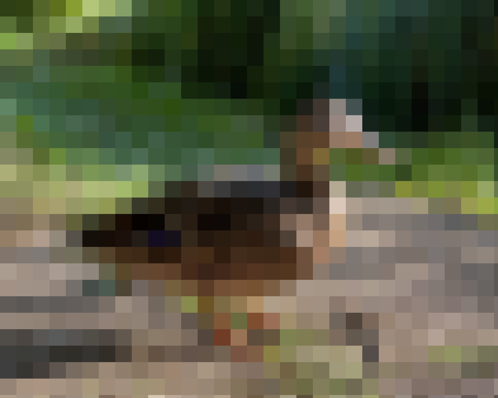
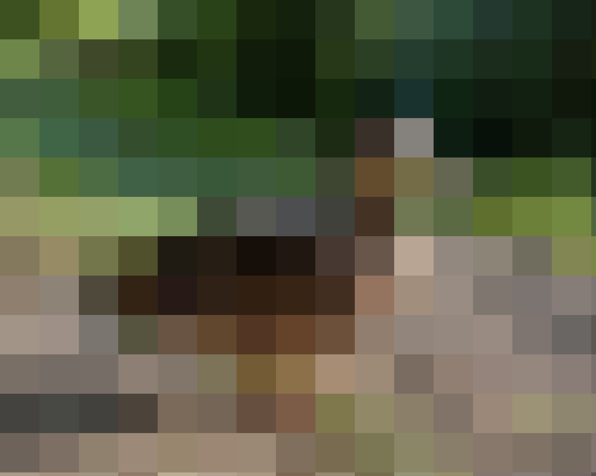

# Pixelate Filter (Mosaic)

This python script provides an easy way to pixelate images. 
This script uses python3 for pixelating and Pillow to read and write images. The result is saved as a PNG file.
</br>
</br>
## Dependencies
The following dependencies must be installed:

* Python 3 (I am using v3.9.7, but below should be fine too)
* Pillow (see https://pillow.readthedocs.io/en/stable/installation.html)

I recommend using package managers like homebrew and pip3.
</br>
</br>
## Usage
1. Download/clone code and navigate to the folder
2. Run the following command
```
python3 mosaic.py <Path to File> <block-size> 
```

With block-size you control the size of the pixelated block. The result depends on the input and the dimensions. 
</br>
</br>
## Examples
See the following examples below.

Original            |  block-size=50         | block-size=100
:-------------------------:|:-------------------------:|:------------
  |   | 

